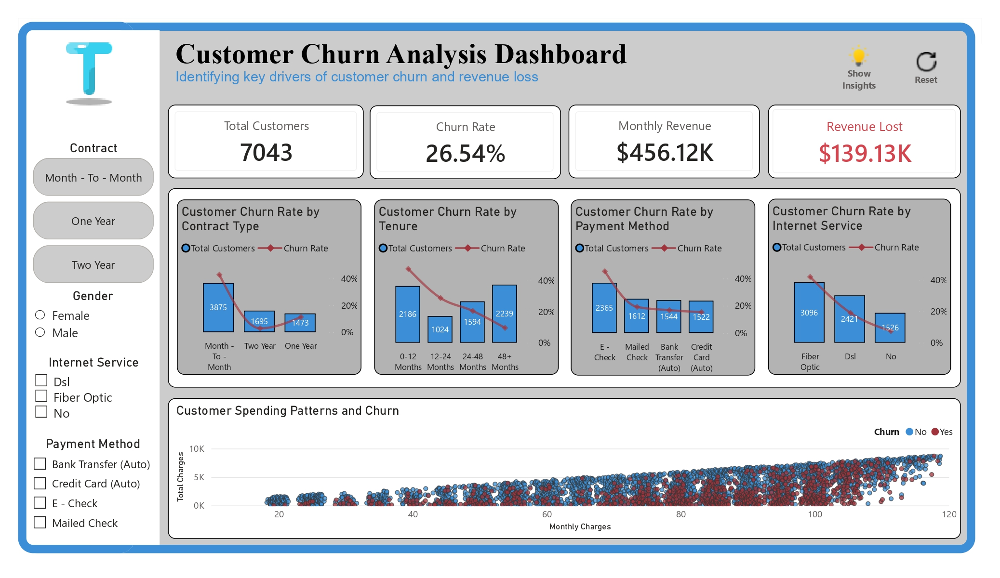
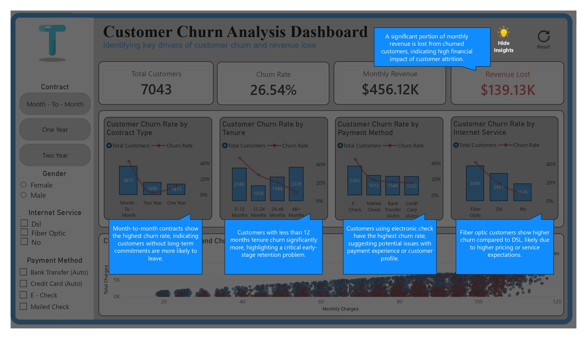

# 📊 Customer Churn Analysis Dashboard

## 📌 Project Overview
This project analyzes **customer churn behavior** in a telecom company to identify key drivers of **customer attrition** and **revenue loss**. The goal is to uncover **actionable insights** that can improve customer retention.

---

## 🎯 Objectives
- Identify key factors influencing **customer churn**
- Analyze churn patterns across **customer segments**
- Quantify the **revenue impact of churn**
- Provide **data-driven recommendations** for retention

---

## 🗂 Dataset
- **Telco Customer Churn Dataset** (IBM sample dataset)  
- Includes customer demographics, services, billing, and churn status  

---

## 🛠 Tools & Workflow

### 🔹 1. Excel (Data Cleaning & Preparation)
- Reviewed dataset structure and quality  
- Identified missing values in **Total Charges**  
- Cleaned and handled missing values directly in Excel  
- Converted **Total Charges** to numeric format   
- Exported cleaned dataset as CSV  

---

### 🔹 2. SQL (Data Analysis)
- Imported cleaned dataset into SQL database  
- Created structured tables for analysis  
- Wrote queries to:
  - Calculate **churn rate**
  - Segment customers by **contract, tenure, and services**
  - Aggregate **revenue and churn metrics**  
- Prepared datasets for visualization  

---

### 🔹 3. Power BI (Dashboard Development)
- Imported cleaned dataset into **Power BI**  
- Built data model and relationships  
- Created key measures:
  - **Total Customers**
  - **Churn Rate**
  - **Monthly Revenue**
  - **Revenue Lost**  
- Designed interactive dashboard:
  - Column & line charts for churn comparison  
  - Scatter plot for customer behavior  
- Added slicers:
  - Contract, Gender, Internet Service, Payment Method  
- Implemented:
  - **Reset Filters button**
  - **Toggleable Insights Panel (Bookmarks)**
- Applied consistent layout and formatting  

---

## 📊 Dashboard Features

### 🔹 KPIs
- **Total Customers:** 7043  
- **Churn Rate:** 26.54%  
- **Monthly Revenue:** $456K  
- **Revenue Lost:** $139K  

### 🔹 Visualizations
- Customer Churn Rate by Contract Type  
- Customer Churn Rate by Tenure  
- Customer Churn Rate by Payment Method  
- Customer Churn Rate by Internet Service  
- Customer Charges vs Tenure (Scatter Plot)  

### 🔹 Interactive Features
- Dynamic slicers for filtering  
- Reset filters functionality  
- Interactive insights panel  

---

## 🔍 Key Insights
- **Month-to-month contracts** show the highest churn rate  
- **New customers (<12 months)** are most likely to churn  
- **Electronic check users** have higher churn risk  
- **Fiber optic customers** churn more than DSL users  
- Churn leads to **significant revenue loss**  

---

## 💡 Business Recommendations
- Promote **long-term contracts** through incentives  
- Improve **onboarding experience** for new customers  
- Investigate churn among **electronic check users**  
- Enhance value proposition for **fiber optic services**  

---

## 📷 Dashboard Preview

---

## 📁 Project Structure
Customer-Churn-Analysis/ 
│ 
├── data/ 
│ ├── raw_data.xlsx 
│ ├── cleaned_data.csv 
│ 
├── sql/ 
│ └── queries.sql 
│ 
├── powerbi/ 
│ └── churn_dashboard.pbix 
│ 
├── images/ 
│ └── dashboard.png 
│ 
└── README.md 

---

## 🚀 How to Use
1. Open the `.pbix` file in Power BI Desktop  
2. Use slicers to explore different customer segments  
3. Analyze churn patterns across categories  
4. Toggle the insights panel for key findings  

---

## 📌 Conclusion
This project demonstrates a complete **data analysis workflow**, from data cleaning in Excel to analysis in SQL and visualization in Power BI. It highlights key churn drivers and provides insights to improve **customer retention and revenue performance**.

---

## 👤 Author
Gaurav Yadav 
